# Developer Guide

## Table of content
### [1. Introduction](#1-Introduction1)
#### [1.1 Software Overview](#11-Software-Overview1)
#### [1.2 Purpose](#12-Purpose1)
#### [1.3 Scope](#13-Scope1)
### [2. Setting up and getting started](#2-Setting-up-and-getting-started1)
### [3. Design](#3-Design1)
#### [3.1 Architecture](#31-Architecture1)
#### [3.2 Classes](#32-Classes1)
##### [3.2.1 Logic class](#321-Logic-class1)
##### [3.2.2 UI class](#322-UI-class1)
##### [3.2.3 Parser class](#323-Parser-class1)
##### [3.2.4 Customer class](#324-Customer-class1)
##### [3.2.5 Order class](#325-Order-class1)
##### [3.2.6 Canteen class](#326-Canteen-class1)
##### [3.2.7 Stall class](#327-Stall-class1)
##### [3.2.8 Dish class](#328-Dish-class1)
##### [3.2.9 Exception class](#329-Exception-class1)
### [4. Implementation](#4-Implementation1)
### [5. Testing](#5-Testing1)
### [6. Appendix: Requirements](#6-Appendix-Requirements1)
#### [6.1 Product scope](#61-Product-scope1)
#### [6.1.1 Target user profile](#611-Target-user-profile1)
#### [6.1.2 Value proposition](#612-Value-proposition1)
#### [6.2 User stories](#62-User-stories1)
####  [6.3 Non-Functional Requirements](#63-Non-Functional-Requirements1)
#### [6.4 Glossary](#64-Gloossary1)
#### [6.5 Instructions for manual testing](#65-Instructions-for-manual-testing1)

## 1. Introduction

### 1.1 Software Overview
During peak hours, people may not be able to know the dining situation and the density of the canteen they want to go to. To solve this problem, we want to create a program to store and display basic information of stalls in each canteen (e.g. Open hours, current menu, change order etc) to all their potential users. CanteenHelper is a command line (CLI) application that helps students, staff and even tourists order food in canteens efficiently. CanteenHelper will allow users to choose their favorite dishes from different stalls in different canteens based on the date and time provided by the users. They also can check the comments of the dishes and operating hours of the stalls and canteens.

### 1.2 Purpose
This document describes the architecture and software design of CanteenHelper. The goal of this document is to cover the high-level system architecture and design.
The document is divided into three main parts: design, implementation and documantation. The design includes the architecture diagram and the introduction of each class. The implementation consists of some details on how certain features are implemented and how the users go through our app. The documentation details the logging, testing and configuration of CanteenHelper. It also includes the requirement and the instructions for manual testing in the appendices.

### 1.3 Scope
The intended audience of this document is the developers, designers, and software testers of CanteenHelper.

## 2. Setting up and getting started

Before you start: Please ensure you have Java 11 installed in you computer.
1) Fork this repo from this link: https://github.com/AY2021S1-CS2113-T16-2/tp
2) Clone the fork to your own computer. You are highly recommended to use Git tool (like Sourcetree) to track your work.
3) Use your own IDEA to program. You are highly recommended to use IntelliJ IDEA. Please check whether you have correct JDK version (JDK 11) in your computer and congiure the JDK.
      If you are using IntelliJ IDEA:
      -Open IntelliJ
      -Set up JDK 11 for Gradle
            Click Configure -> Project Defaults -> Project Structure
            Click New... and set it to the directory of the JDK 11 installed
4) Import the project as a Gradle project.
      If you are using IntelliJ IDEA:
      -Click Import Project (or Open or Import in newer version of Intellij).
      -Locate the build.gradle file (not the root folder as you would do in a normal importing) and select it. Click OK.
      -Click OK to accept the default settings but do ensure that the selected version of Gradle JVM matches the JDK being used for the project.
      -Wait for importing process to complete

5) Do the testing. Please follow the testing guide.

## 3. Design

### 3.1 Architecture

Figure 1.Architecture Diagram

The Architecture Diagram given above explains the high-level design of our App. Below are the main components of our product.

Main(Logic): The main logic flow of our whole App.

Initializer: Initialize the whole app to start waiting for the input from the users.

UI: The user interface of our App.

Parser: Change the user input to something meaningful to the app.

Exception: Throw different kinds of exception that user may make.

The following section is a more detailed description of these four components.

### 3.2 Classes
The CanteenHelper consists of six classes:
* `Logic`
* `UI`
* `Parser`
* `Customer`
* `Order`
* `Canteen`
* `Stall`
* `Dish`
* `Exception`

#### 3.2.1 Logic class

Figure 2.Main Logic Diagram

Main logic of the whole app.

Main method inside: main(String[] args)

#### 3.2.2 UI class
Mainly managed in MainPage, which contains several parts: showCommand, displayInfo, getInput. All of these should inherit from an abstract class UserInterface class. And this class can
1. Show all possible executable commands in numeric order
    E.g. 1: Get open canteens
         2: Get open stalls
2. Get user input (number) and use the Logic component to execute the corresponding user’s command
3. Display the results of user and program interactions

Main method inside: 

order(List<Canteen> canteens, Customer customer,Scanner sc, ArrayList<Order> Order); 

getCustomer(Scanner sc); 

getOrder(Customer customer, Canteen canteenChoosed, Stall stallChoosed, List<Dish> orderedDishes,Scanner sc, ArrayList<Order> Order); 

getDishes(Stall stallChoosed, Scanner sc); 

getYN(Scanner sc); 

getNumOfDishes(int count,Scanner sc); 

getStall(Customer customer, Canteen canteenChoosed, Scanner sc); 

getCanteen(List<Canteen> canteens, Customer customer, Scanner sc); 

greet(); 

bye();

help(); 

checkComment(List<Dish> dCs); 

checkCanteenOperatingTime(List<Canteen> canteens,Customer customer,Scanner sc); 

checkStallOperatingTime(List<Canteen> canteens,Customer customer,Scanner sc); 

changeOrder(Customer customer,String input,ArrayList<Order> Order); 

printOrder(String input,ArrayList<Order> Order); 

deleteOrder(String input,ArrayList<Order> Order); 

findDishinOrder(String input,ArrayList<Order> Order); 

#### 3.2.3 Parser class
Deals with making sense of the user's command and pass the command to certain functions.

Main method inside: 
parseCustomer(String inputMessage)

#### 3.2.4 Customer class
Customer contains the list of open canteens and initializes Order objects.

Main method inside: 
checkOpenStalls(Canteen canteen); 

checkOpenCanteens(List<Canteen> ListCanteen); 

checkDish(List<Dish> ListDish); 

checkWaitingTime(Stall stall); 

#### 3.2.5 Order class
Order contains the list of dishes that are ordered.

#### 3.2.6 Canteen class
Canteen contains the list of stalls.

Main method inside: 

isOpen (int dayOfWeek, int time); 

#### 3.2.7 Stall class
Stall contains the list of dishes.

Main method inside: 

isOpen (int dayOfWeek, int time); 

printDishes()

#### 3.2.8 Dish class
Dishes that can be ordered by the user.

#### 3.2.9 Exception class
Exceptions that can catch user unexpected input.

### 3.3 Overall Sequence Diagram

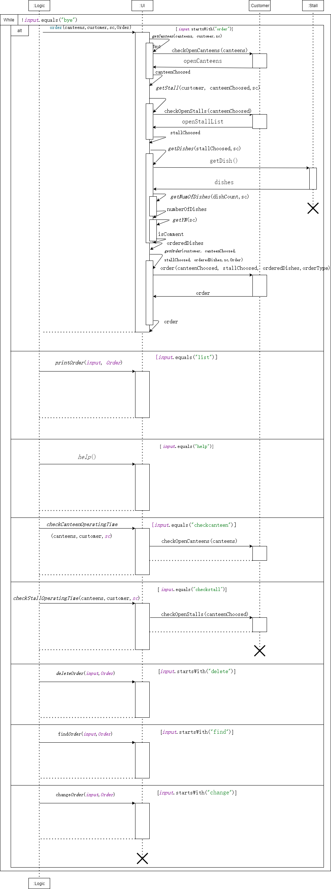

Figure 3.Overall Sequence diagram 

## 4. Implementation
#### Feature: order
The user types command “order” to make an order from a stall in a canteen. The order method will be activated and print open stalls through checkOpenCanteens method in Customer class in this manner:

 
User just type the corresponding index before the canteen to select canteen. Then the open stalls in this canteen will be printed through checkOpenStalls method in Customer class in this manner:

 
User just type the corresponding index before the stall to select stall. Then the available dishes and price in this stall will be printed through getDish() method in Stall class in this manner:

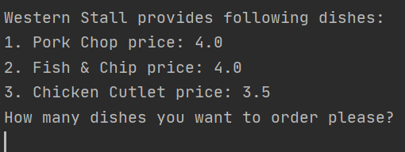
 
User just type number of dishes he wants to order and chooses dishes in the same way as they select canteen and stall. 

After that, user will be asked whether he wants to see the comment of the dish.

Finally, after choosing dine in, take away or delivery, an order object will be created and added into the order list.

#### Feature: delete order
The user enters the command: delete [number] to delete an order in the order list. The main will enable the deleteOrder () method. The Parser will make sense of the command and delete the corresponding order from the order list. 
e.g. delete 1 means delete the first order in the order list.

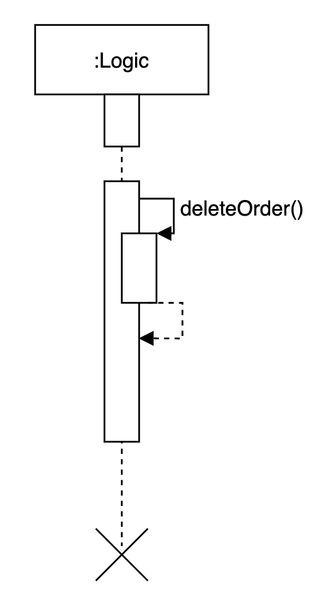

Figure 4.Sequence diagram for deleteOrder()

#### Feature: find order
The user enters the command: find [dish name] to find the order contains this dish in the order list. The main will enable the findDishinOrder() method. The Parser will make sense of the command and iterate the order list and dish list to print the order containing this dish. 
e.g. find chicken rice means find all orders containing chicken rice in the order list.

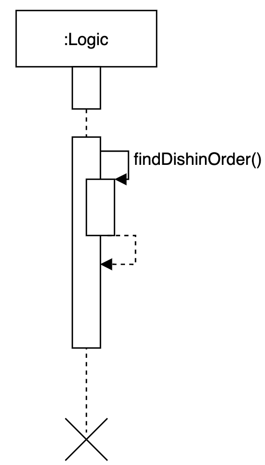

Figure 5.Sequence diagram for findDishinOrder()

#### Feature: list order
The user enters the command: list to print all the orders in the order list . The main will enable the printOrder() method. The printOrder() method will iterate the whole order list and print all the orders

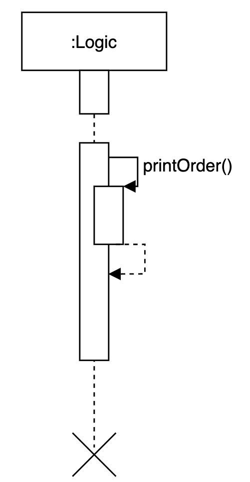

Figure 6.Sequence diagram for printOrder()

#### Feature: change order (change dine in, take away or delivery)
The user enters the command: change/number/type to change the order type of one order in the order list. The main will enable the changeOrder() method. The Parser will make sense of the command and change the corresponding order’s order type. 
e.g. change/1/Dine in: change order 1 to dine in

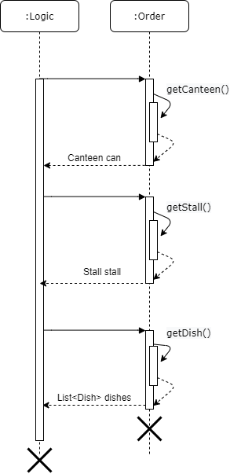

Figure 7.Sequence diagram for changeOrder()

#### Feature: check Canteen Operating Time
The user enters the command: checkcanteen to check the operating time of an open canteen. The main will enable the checkCanteenOperatingTime() method. It prints open canteens through checkOpenCanteens method in Customer class in this manner:

User can type the number before the canteen name to check its operating time.

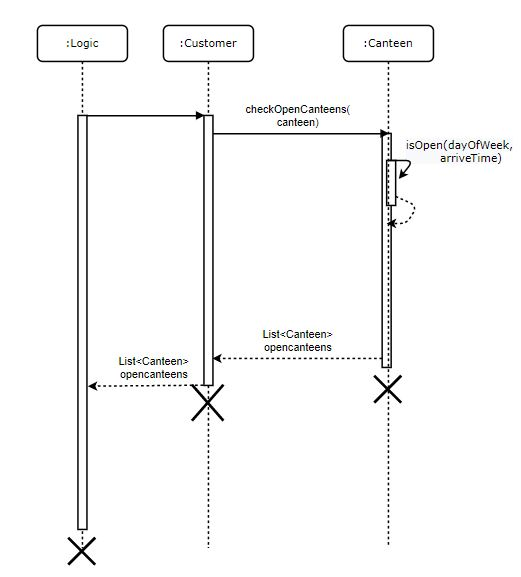

Figure 8.Sequence diagram for checkCanteenOperatingTime()

#### Feature: check Stall Operating Time
The user enters the command: checkstall to check the operating time of an open stall. The main will enable the checkStallOperatingTime() method. It prints open canteens through checkOpenCanteens method in Customer class in this manner:
 

User can type the number before the canteen name to display the stalls inside the canteen in this manner.
 
User can type the number before the stall name to check its operating time.

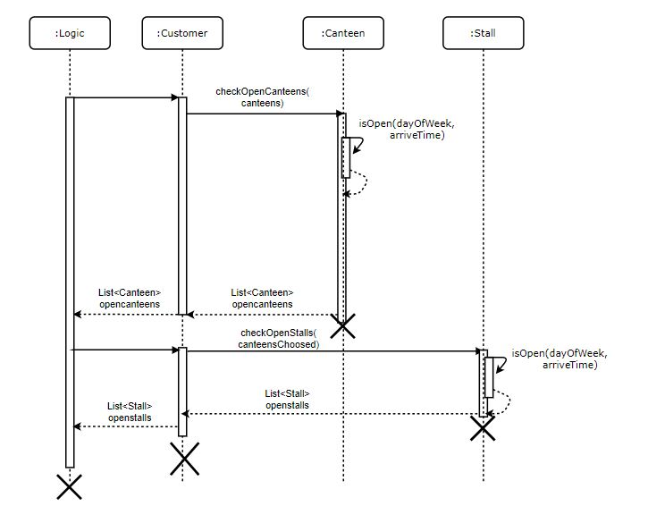

Figure 9.Sequence diagram for checkStallOperatingTime()

#### Feature: help
The user enters the command: help to view all commands that are available. The main will enable the help() method. It prints all available commands.

## 5. Testing
### To perform manual testing, please follow the instructions bellow

### 5.1 Before the order: `[name]/[day of week]/[time]`

Format: `[name]/[day of week]/[time]`

Example of usage:
'wy/2/1800'
‘fqy/1/1200

* day of week should between 1-7 (includes)
* time should follow this format: 900 or 1600, represent 09:00 and 16:00 respectively.

Result is like this:

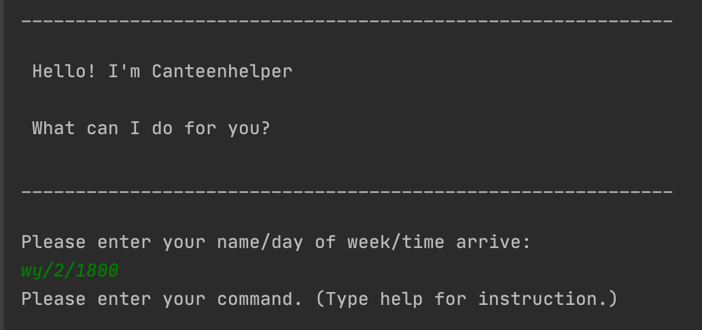

### 5.2 Begin the order: `order`
begin the order of a customer

#### 5.2.1 Firstly

Format: `order`

Example of usage:
'order'

Result is like this:

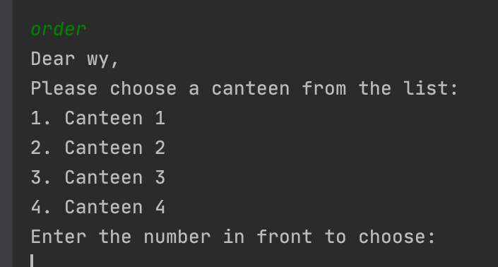

#### 5.2.2 The order method will be activated and print open stalls, user just type the corresponding index before the canteen to select canteen. 

Format: `[number]`

Example of usage:
'2'

Result is like this:

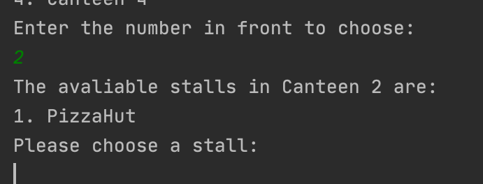

#### 5.2.3 Then the open stalls in this canteen will be printed, user just type the corresponding index before the stall to select stall. 

Format: `[number]`

Example of usage:
'1'

Result is like this:

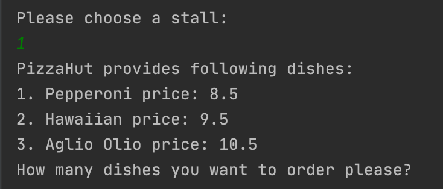

#### 5.2.4 Then the available dishes and price in this stall will be printed, user just type number of dishes he wants to order.

Format: `[number]`

Example of usage:
'2'

Result is like this:

#### 5.2.5 User chooses dishes in the same way as they select canteen and stall. 

Format: `[number]`

Example of usage:
'2'

Result is like this:

#### 5.2.6 User will be asked whether he wants to see the comment of the dish, just type y/n.

Format: `y/n`

Example of usage:
'y'

'n'

Result is like this:

#### 5.2.7 User choose the order type by typing the corresponding index before the type.

Format: `[number]`

Example of usage:
'2'

Result is like this:

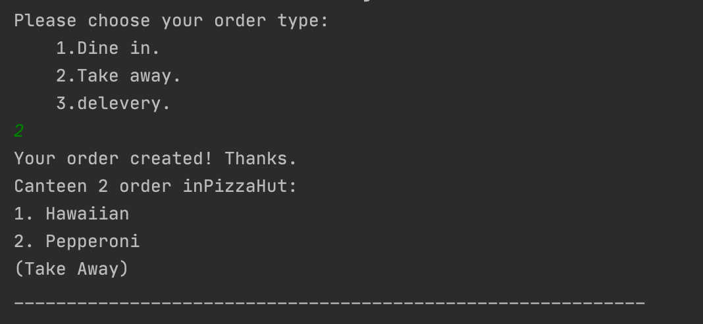

### 5.3 delete the specific order: `delete [number]`
delete the order based on the number from user
user needs to input the number of order 

Format: `delete [number]`

Example of usage:
'delete 1'

Result is like this:

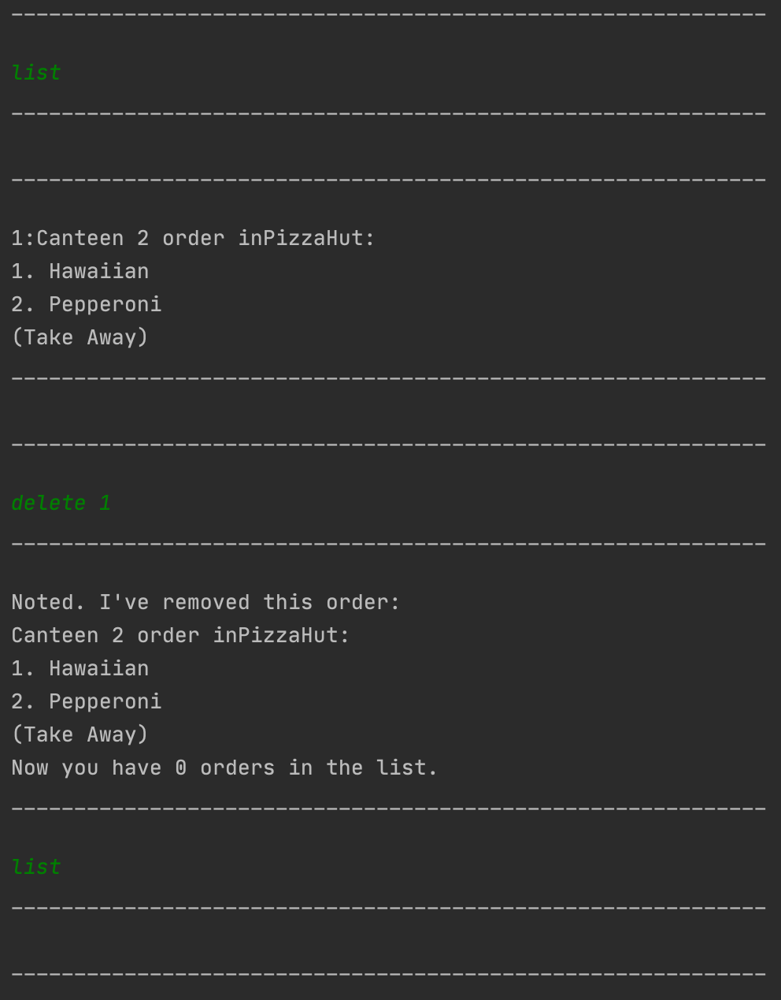

### 5.4 find the specific order: `find [dish name]`
find the specific dish based on the user input dish name
from the order list made by the user

Format: `find [dish name]`

Example of usage:
'find Hawaiian'

Result is like this:

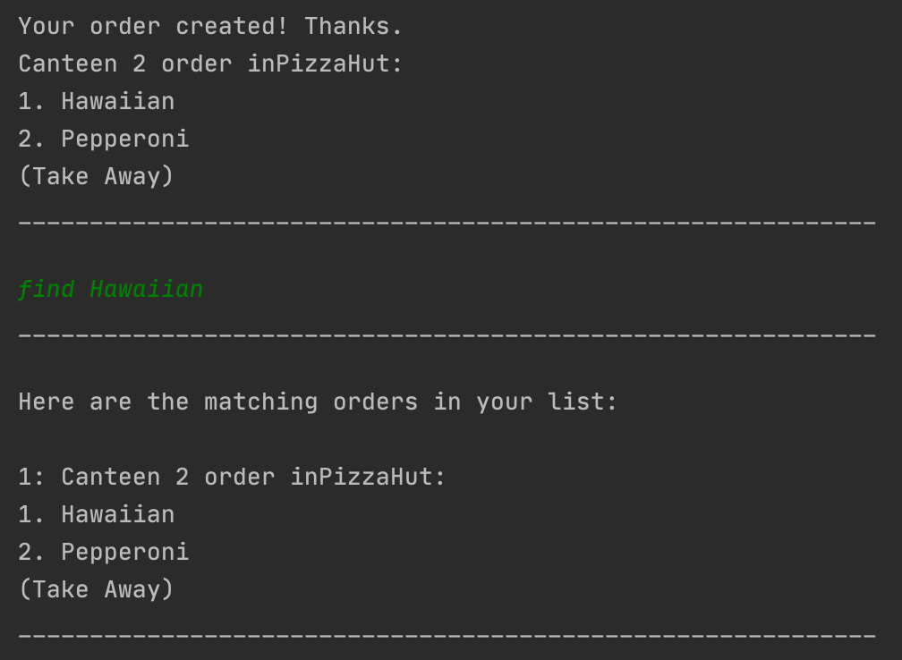

### 5.5 list all the orders: `list`
check all the orders made by this user

Format: `list`

Example of usage:
'list'

Result is like this:

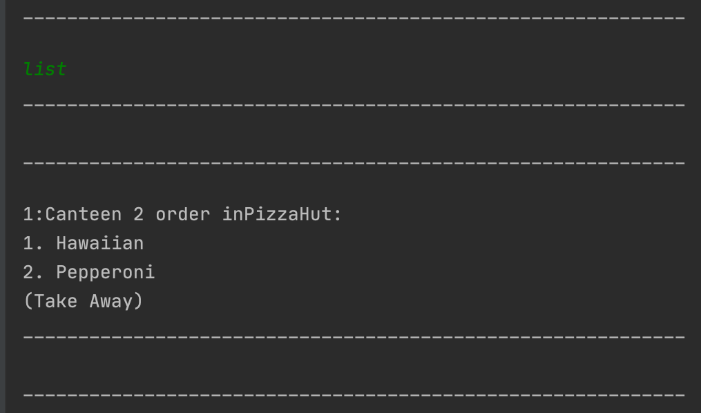

### 5.6 change the order: `change/[number]/[type]`
Change the order type to the type user inputed

Format: `change/[number]/[type]`

type should choose from:
1. dine in
2. delivery
3. take away

Example of usage:
'change/2/dine in'
'change/1/delivery

* order type is case sensitive

Result is like this:

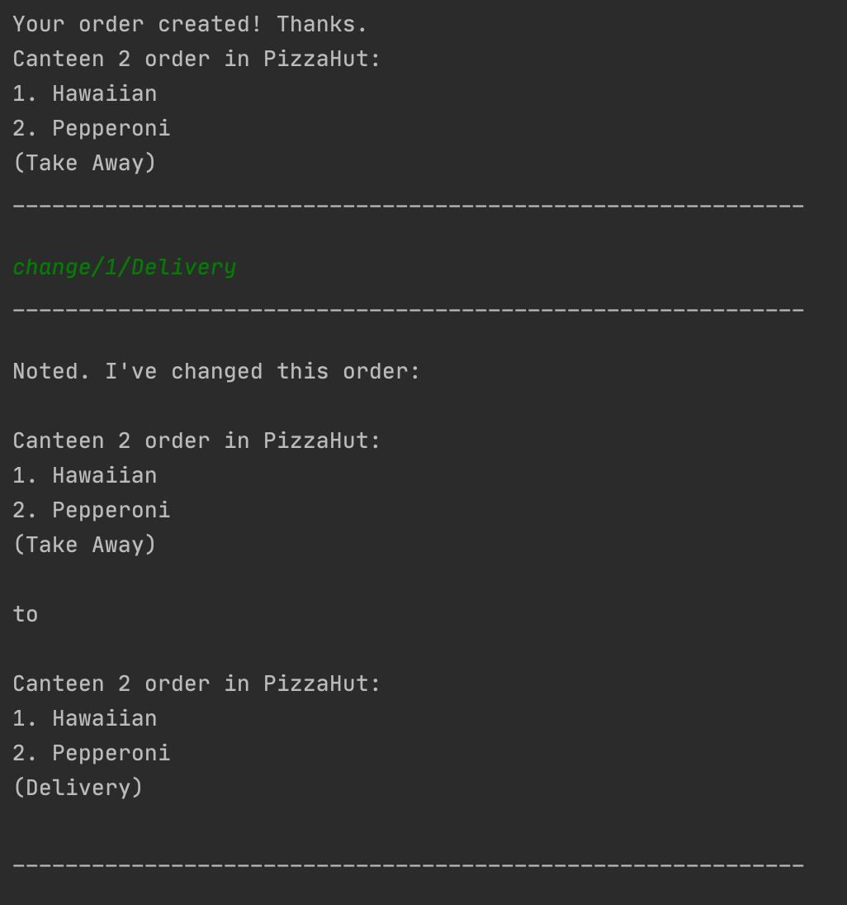

### 5.7 check Canteen Operating Time: `checkcanteen`
check the operating hours of a canteen 

#### 5.7.1 Firstly

Format: `checkcanteen`

Example of usage:
'checkcanteen'

#### 5.7.2 User enters the number before canteen to check that specific canteen

Format: `[number]`

Example of usage:
'4'

Result is like this:

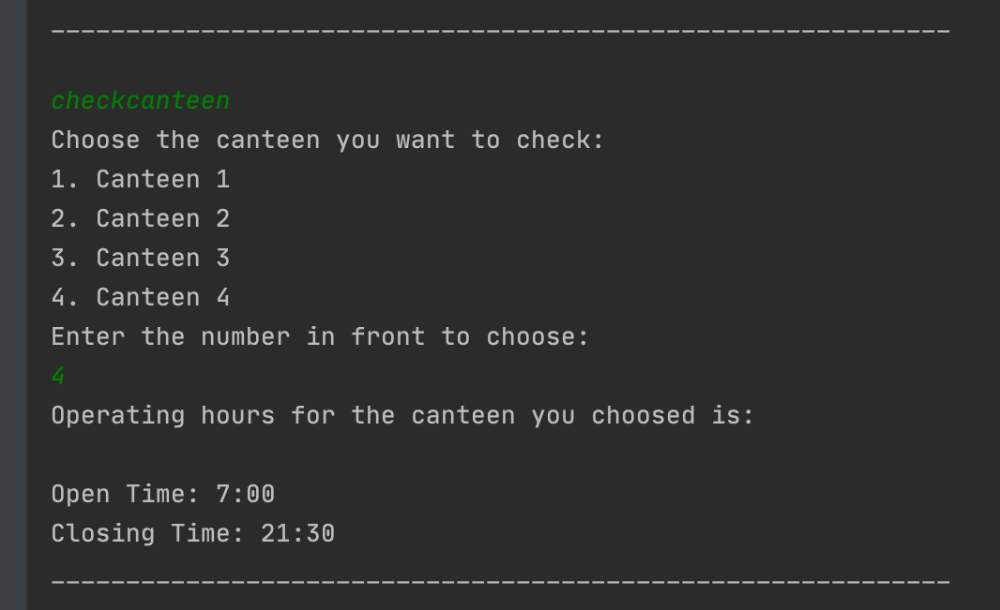

### 5.8 check Stall Operating Time: `checkstall`
check the operating hours of a stall 

#### 5.8.1 Firstly

Format: `checkstall`

Example of usage:
'checkstall'

#### 5.8.2 User enters the number before canteen to check that specific canteen

Format: `[number]`

Example of usage:
'3'

#### 5.8.3 User enters the number before stall to check that specific stall

Format: `[number]`

Example of usage:
'2'

Result is like this:

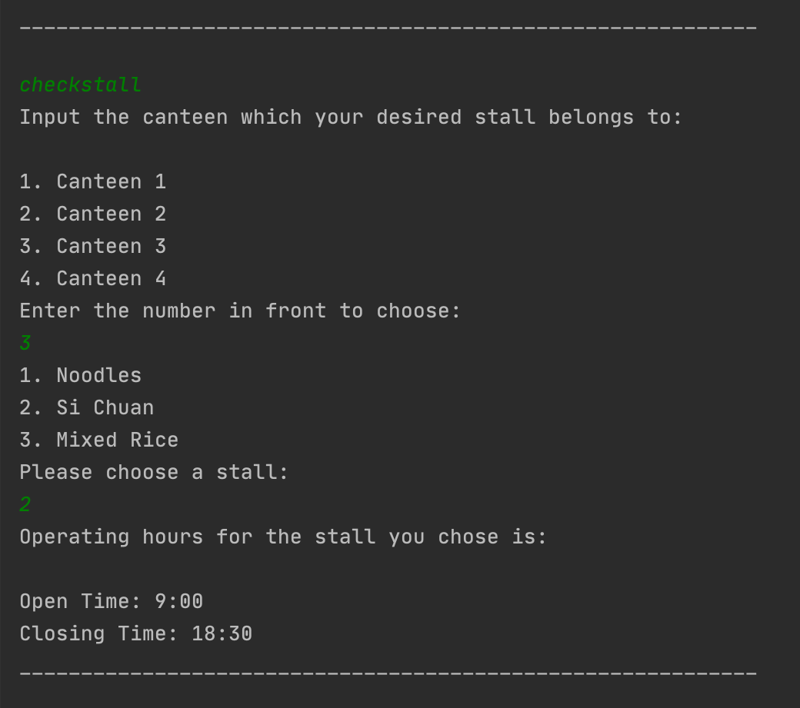

### 5.9 view all available commands: `help`
print all the commands with required format that the user can input

Format: `help`

Example of usage:
'help'

Result is like this:

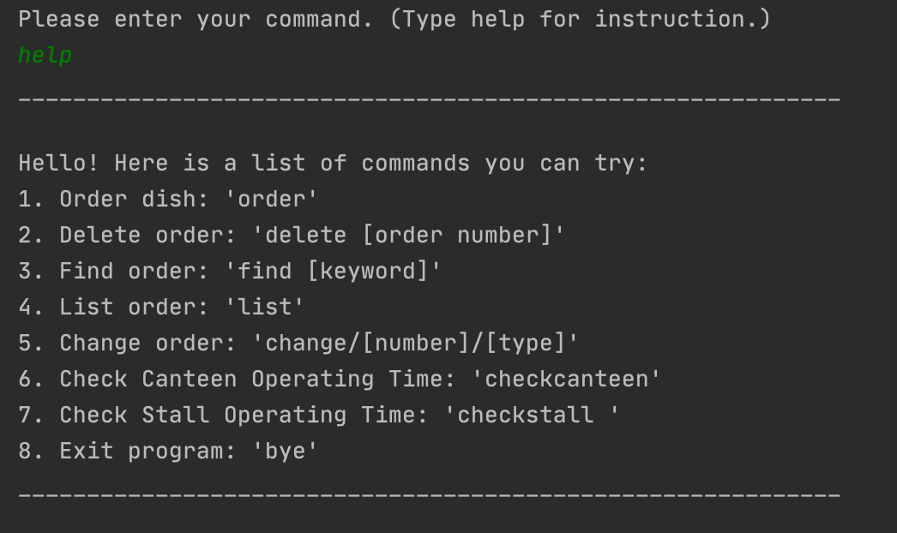

### 5.10 quit the system: `bye`
quit the system

Format: `bye`

Example of usage:
'bye'

Result is like this:

## 6. Appendix: Requirements

### 6.1 Product scope

#### 6.1.1 Target user profile
All the NTU undergraduate, graduate and faculty who need to dine at NTU canteens.

#### 6.1.2 Value proposition
CanteenHelper aims to assist the target audience with:
ordering the meals in one application efficiently

### 6.2 User stories

|Version| As a/an ... | I want to ... | So that I can ...|
|--------|----------|---------------|------------------|
|v1.0|user|view which canteens are open now|decide which canteen to go to now|
|v1.0|user|view which stalls are available currently|make my order|
|v1.0|hungry person who wants to dine now|check the menus of some stalls at the current time|I can order my preferred meal in the menus|
|v1.0|user who is deciding what to have for the next meal|view the menus of the stalls in advance|I can know what to eat for that meal in the future|
|v2.0|user|check the operating time of canteens|I can go to the canteen which is  open|
|v2.0|user who wants to try a new dish|check the comments made by others|I can have a brief idea about it|
|v2.0|user|change the order type of my order|fit my time schedule more|

### 6.3 Non-Functional Requirements
1. The app should be able to work on any mainstream OS with Java 11 or above installed.
2. Commands entered should follow the user guide.

### 6.4 Glossary
* *Sequence Diagram* - A sequence diagram shows object interactions arranged in time sequence.
* *mainstream O* - Linux, Windows, Unix.

### 6.5 Instructions for manual testing
Try different inputs with variations of the format, to check whether the exceptions are being correctly thrown.

